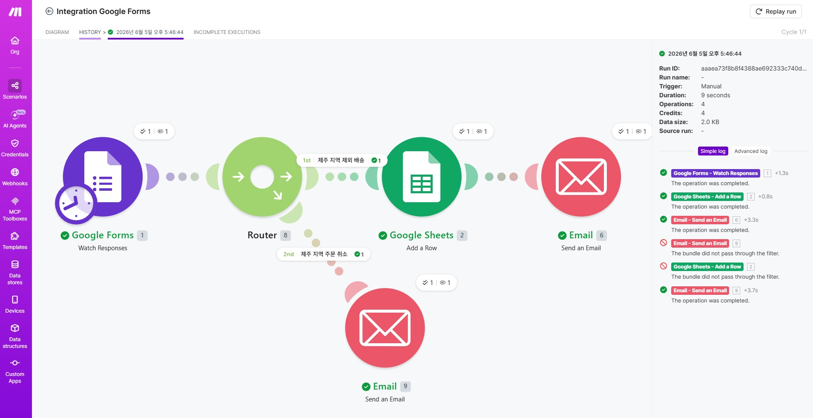
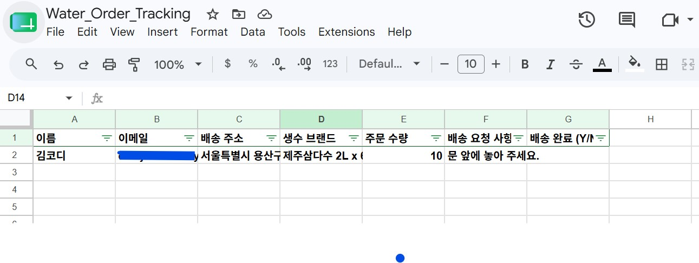
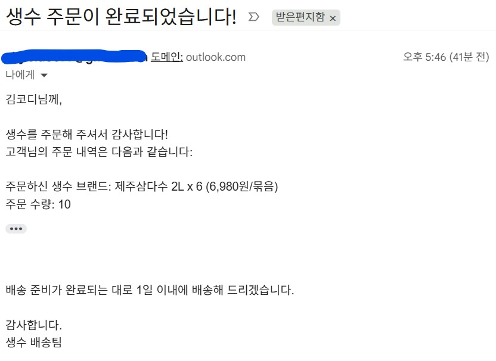
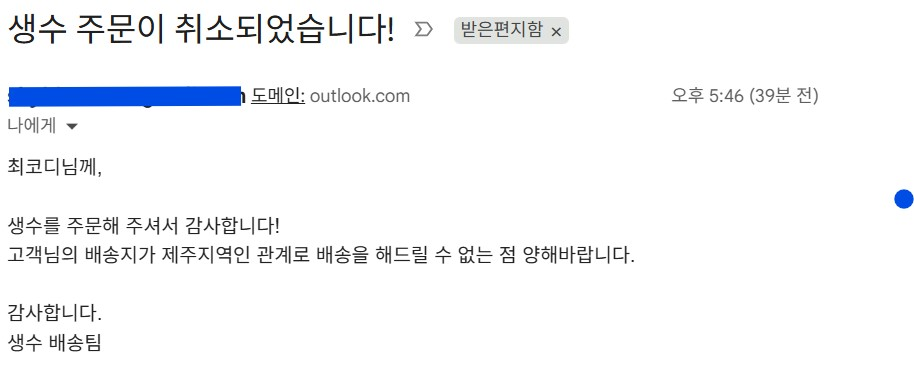
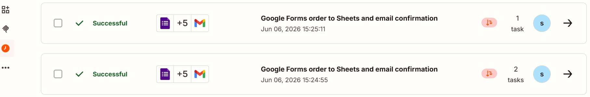
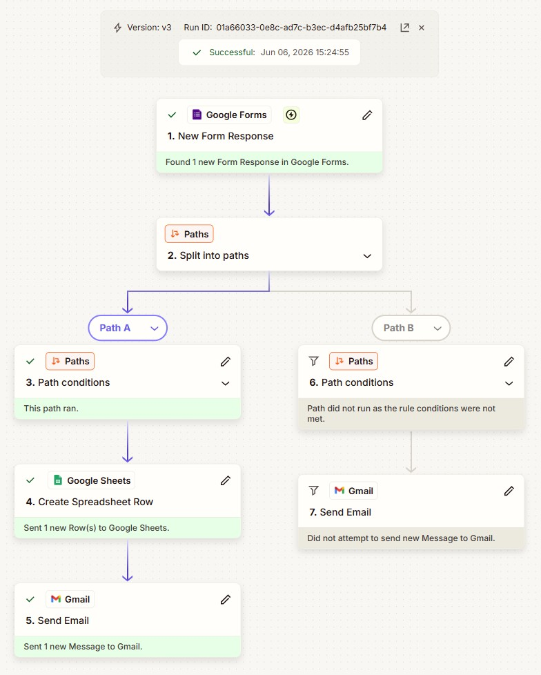
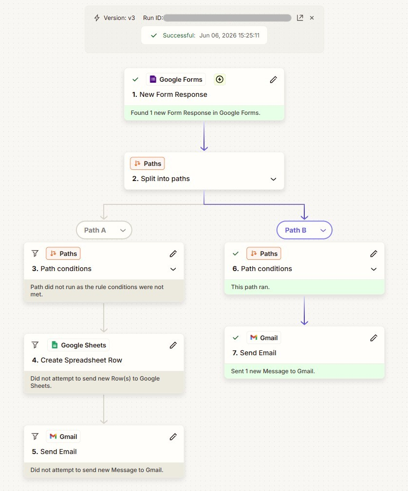
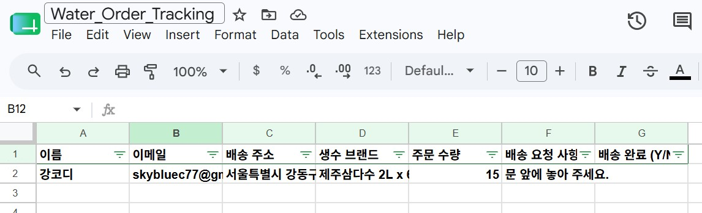
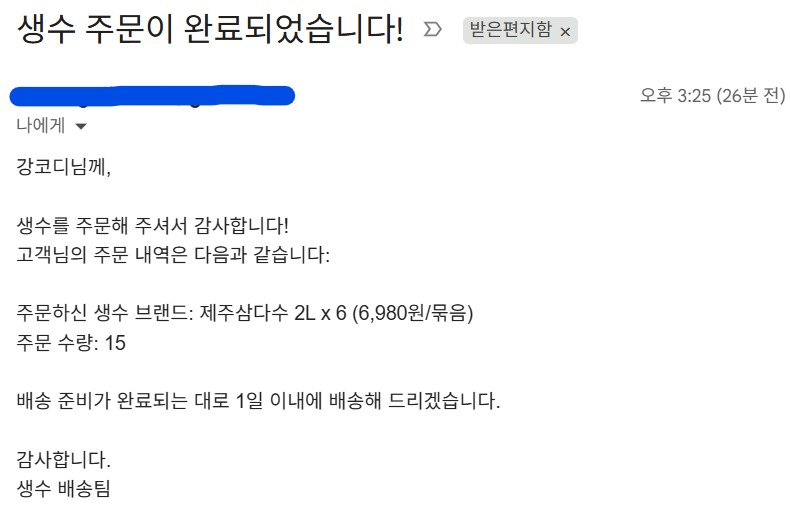

# 프로젝트 1 - 자동화 도구 비교 구현 보고서

<p align="left">
  
</p>

* **사용된 자동화 도구**: Make(구 Integromat)와 Zapier
* **자동화할 업무**: Google Forms 주문 접수 처리 후 배송 지역(제주도 제외)에 따라 분기 처리 후 Google Spreadsheets 기록과 자동 이메일 보내기

## 1. 도구별 구현 과정 요약

### 1.1 Make 워크플로우
* **Trigger (시작 이벤트):** Google Forms - Watch Responses
* **조건 분기 (Router):** 배송지가 제주 지역일 때 / 아닐 때
* **Action (처리 동작):**
    * **Action 1:** Google Sheets - Add a Row (제주 지역이 아니면)
    * **Action 2:** Gmail - Send an email (제주 지역일 때 / 아닐 때 모두 전송)

### 1.2 Zapier 워크플로우
* **Trigger (시작 이벤트):** Google Forms - New Form Response
* **조건 분기 (Path):** 배송 지역에 따른 분기 처리 (제주도 제외)
* **Action (처리 동작):**
    * **Action 1:** Gmail - 이메일 보내기
    * **Action 2:** Google Sheets - 열 추가

_참고) 조건 분기에서 Make는 'Router'모듈과 'Filter'를, Zapier는 'Path'나 'Filter'를 씀._

<details>
<summary>[참고: 구글 폼 양식 / 이메일 전문]</summary>
<br>

* [구글 폼 양식](https://docs.google.com/forms/d/e/1FAIpQLSf-sqa5DHSwfnAFYdEX0eH5yxxSKcf8hpF_f1cmIOMoxSkr2A/viewform?usp=publish-editor)

* 이메일 전문:

    제주 지역이 아닌 경우:
    ```
    제목: 생수 주문이 완료되었습니다!
    본문:

    [고객 이름]님께,

    생수를 주문해 주셔서 감사합니다!
    고객님의 주문 내역은 다음과 같습니다:

    주문하신 생수 브랜드: [생수 브랜드]
    주문 수량: [주문 수량]

    배송 준비가 완료되는 대로 1일 이내에 배송해 드리겠습니다.

    감사합니다.
    생수 배송팀
    ```

    제주 지역인 경우:
    ```
    제목: 생수 주문이 취소되었습니다!
    본문:

    생수를 주문해 주셔서 감사합니다.
    고객님의 배송지가 제주 지역인 관계로 배송해 드릴 수 없는 점 양해 부탁드립니다.

    감사합니다.
    생수 배송팀
    ```

<br>
</details>

<details>
<summary>[구현 과정]</summary>
<br>

    1. 데이터 소스 연결: 각 도구에 Google 계정 및 협업 툴 계정을 안전하게 연동(OAuth).
    2. 트리거 설정: 실시간(웹훅) 또는 실행 주기 지정 방식으로 마스터 데이터의 변화를 감지하도록 세팅.
    3. 라우터/필터 구축: 데이터의 특정 필드 값을 기준으로 분기 처리 로직을 설계하여 조건 만족 여부를 판별.
    4. 액션 매핑: 이전 단계에서 넘어온 동적 변수(Dynamic Variables)를 가공하여 최종 결과 시스템의 필드에 1:1 매핑.
    5. 테스트 및 디버깅: 테스트 데이터를 발생시켜 분기 시나리오가 모두 정상적으로 작동하고 로그에 기록되는지 최종 확인.

<br>
</details>


## 2. 도구별 자동화 워크플로우 구성 및 실행 결과

아래는 Google forms으로 된 생수 주문서 양식 2개 작성한 후 (한 곳은 비 제주도 지역, 한 곳은 제주 지역으로) 워크플로우를 실행한 결과를 바탕으로 작성하였다.

### 2.1 Make 구현 및 실행 결과
* **워크플로우 구성과 실행 결과 (성공 로그) 화면 캡처:** 조건 분기 성공 로그를 한 번에 볼 수 있다.
    > 
* **구글 시트 행 삽입 실행 결과:** 배송 가능 지역만 행 삽입이 됨.
    > 
* **이메일 보내기 실행 결과:**
    > 
    > 

### 2.2 Zapier 구현 및 실행 결과
* **워크플로우 구성과 실행 결과 (성공 로그) 화면 캡처:** 조건 분기 성공 로그를 따로 봐야 한다. 첫 번째 path는 생수 배송, 두 번째 path는 미배송이다.
    > 
    > 
    > 
* **구글 시트 행 삽입 실행 결과:** 배송 가능 지역만 행 삽입이 됨.
    > 
* **이메일 보내기 실행 결과:**
    > 
    > 

## 3. 자동화 도구 비교 (Make vs Zapier)

| 비교 항목 | Make | Zapier |
| :--- | :--- | :--- |
| UI/UX 구성 방식 | 시각적 캔버스 및 드래그 앤 드롭 노드(Node) 기반. 앱 아이콘이 있어 전체 흐름을 한눈에 보기에 유리. 노드 자유롭게 배치. | 수직 하향식의 고정된 단선형 구조와 단계별(Step-by-step) 형태. 분기 처리도 하향식 계층 구조. 선형적인 구조 파악에 용이. |
| 설정 및 학습 난이도 | 높은 초기 진입 장벽. 데이터 매핑 시 자체 함수 및 문법 이해 필요. | 친숙한 UX와 가이드 제공. 초보자에게 적합. |
| 연동 서비스 및 커넥터 범위 | +3000개 앱 지원. 세부 API 액션 및 Raw HTTP 요청(Webhook) 가공 능력이 있음. | 최대 규모의 앱 연동 생태계 보유(+9000개). |
| 무료 플랜 제공 범위 | 월 1,000 Credits(크레딧) 제공. 최대 2개 활성 시나리오. 월 데이터 전송량 100MB 제한. 무료 플랜에서도 다단계(Multi-step) 및 조건 분기 무제한 활용 가능. | 월 100 Tasks(태스크) 제공. 월 데이터 전송량 제한 없음. 무료 플랜에서는 1:1 단단계 자동화만 가능 (분기/다단계는 유료). |
| 실행 로그 및 디버깅 | 각 노드별 입력(Input)과 출력(Output) 데이터를 그래픽 버블로 직관적으로 확인 및 추적 가능. | Task History 탭에서 텍스트 및 JSON 형태로 단계별 실행 성공/실패 여부와 데이터를 순차적으로 확인. |
* **Make의 크레딧:** 자동화 워크플로우(시나리오) 안에서 실행되는 개별 행동이나 이벤트. 전에는 Operations으로 불림.
    - 예) [메일(트리거) > 구글 시트에 행 추가 > 슬랙으로 알림 전송]의 워크플로우 1개가 작동하면 총 3개의 크레딧이 소진됨.
* **Zapier의 태스크:** 성공적으로 완료한 개별 행동(Action) 1건 (즉, 트리거Trigger, 필터Filter, 경로Path 미포함)
    - 예) [메일(트리거) > 구글 시트에 행 추가 > 슬랙으로 알림 전송]의 워크플로우 1개가 작동하면 총 2개의 태스크가 소진됨.

## 4. 각 도구별 장단점 및 적합 상황

(두 프로젝트 수행을 통해 현재까지 느낀 장단점)

### 4.1 Make
* **장점:**
    * 높은 비용 효율성: 무료 플랜에서도 복잡한 다단계 워크플로우(Multi-step workflow)와 무제한 조건 분기(Router) 사용 가능.
    * 뛰어난 세부 기능: 각 앱의 모듈이 노출하는 세부 기능이 많고 자체 함수들도 있어 앱 간의 데이터를 정교하게 변환할 수 있음.
    * 노드의 자유로운 위치 이동과 간격 조절이 가능하여 전체 그림 수정 가능. 또한, 각 노드에 앱 아이콘이 표시되어 사용된 앱과 기능을 직관적으로 확인 가능하고 전체 시나리오의 흐름을 한눈에 파악하기 용이.
    * 기존 노드의 모듈을 다른 모듈로 교체 가능 (노드간의 연결 고리를 마우스로 우클릭).
* **단점:**
    * 여러 가지 기능이 있어 학습 난이도가 Zapier보다 높음. Make 초보자는 동적 변수 입력시 필드를 깊이 찾아야 하고 에러 해결이 번거로움.
    * 15분마다 자동 실행하게 놔두면 아무 업무도 하지 않았음에도 트리거로 한 시간에 4크레딧을 사용하게 될 수 있음 (반면 재피어에서 트리거는 '태스크'에 들어가지 않음). -> 10일에 10x4x24 = 960 크레딧을 트리거에만 사용하게 됨.
    * 노드가 많아지면 노드 위치를 일일이 이동/정리하기 번거로움. 자동 정렬(Auto-align) 기능이 있지만 일일이 정리 필요함.
    * 레이아웃이 복잡하여 노드가 많아지면 얽힐 수 있음.
    * 지원하는 앱의 수가 Zapier보다 낮음(+3000개).
    * 무료 플랜은 월 100MB 데이터 전송량 제한.
* **추천 적합 상황:**
    * 적은 비용으로 복잡한 조건 분기 및 다단계 연동과 정교한 데이터 처리가 필요한 대형 워크플로우를 만들 때. 무료로 웹훅(Webhook)을 써야 할 때. 이미지나 파일이 아닌 텍스트 데이터 위주의 워크플로우를 만들 때.

### 4.2 Zapier
* **장점:**
    * 초보자 친화적: 설정이 쉽고 빠르며, UI 가이드라인을 따라가기만 하면 복잡한 연동도 완성됨.
    * 많은 SaaS와 호환: 9000개 이상 SaaS 소프트웨어 앱과 연동 지원.
    * 무료 플랜에서도 월 데이터 전송량 제한 없음.
    * 사용하려는 앱이 Zapier에 있으면, 웹훅이 필요하지 않음.
    * 기존 스텝 다른 스텝으로 교체 가능
    * 현 프로젝트 한정: 전체 워크플로우가 아닌 각 단계마다 테스트를 하게 해줌.
* **단점:**
    * 높은 비용 장벽: 다단계 연동, 조건 분기(Filter or Paths), 웹훅을 쓰려면 유료 플랜을 구독해야 하며 (처음 가입 후 무료 플랜에서 14일동안 웹훅 사용 가능) 태스크 초과 시 과금 압박 있음.
    * 단계 간의 거리가 조절 불가능하여 트리의 구조가 커져서 줌 아웃하게 되면 한 눈에 무엇을 하는지 보기 어려움.
* **추천 적합 상황:**
    * 비용 상관없이 다루기 쉽고 대중적인 소프트웨어를 위주로 빠르게 연동하여 단순한 자동화를 구축하고 싶을 때.

<details>
<summary>[추천 적합 상황: 상세 예시]</summary>
<br>

### Zapier 자피어에 적합한 업무
- 특징: 초보자 친화적, +9000개 이상의 앱 지원. 코딩 지식 없이도 몇 번의 클릭만으로 직관적인 자동화(Zap) 생성 가능.
- 업무 예시:
    - **리드 수집 및 알림**: 웹사이트 문의 폼(예: Typeform)에 고객이 정보를 남기면, 즉시 Slack이나 잔디(Jandi) 채널로 알림을 보내고 Gmail로 환영 이메일 발송.
    - **간단한 파일 백업**: 첨부 파일이 포함된 이메일이 오면, Gmail 라벨을 기준으로 특정 파일을 Google Drive의 특정 폴더에 자동 저장.
    - **블로그 SNS 자동 배포**: WordPress에 새 글이 발행되면 X(구 트위터), Facebook, LinkedIn에 제목과 링크를 자동 포스팅.

### Make 메이크에 적합한 업무
- 특징: 복잡한 조건문(Router)이나 필터, 대용량 데이터 처리에 강력. Zapier보다 정교한 워크플로우를 구성할 수 있으며 비용 효율성이 매우 높음.
- 업무 예시:
    - **AI 기반 맞춤형 고객 지원**: 특정 메일이나 SNS 댓글(예: 인스타그램)이 들어오면 AI(OpenAI API)가 내용의 긍정/부정(감성 분석)을 파악하여 상황에 맞는 대댓글이나 응답을 자동으로 작성.
    - **다단계 예약 및 결제 관리**: Stripe에서 결제가 완료되면, Google Sheets에 내역 기록 -> Airtable에 고객 데이터 생성 -> Notion에 프로젝트 폴더 자동 생성.
    - **주기적인 데이터 통합 및 보고**: 매일 오전 9시, 여러 부서의 Google Sheets 데이터를 모니터링하여 조건에 맞는 데이터를 취합한 뒤, Mailchimp를 통해 뉴스레터 형식으로 자동 발송.

<br>
</details>

---

용어 해설:

* **트리거 Trigger:** 자동화의 시작점으로, 특정 이벤트(예: 새로운 구글 문서 생성, 새로운 이메일 수신)가 발생할 때 작동함.
* **액션 Action:** 앞의 트리거나 전 단계의 액션에서 가져온 데이터를 바탕으로 수행하는 작업(예: 이메일 작성, 슬랙 메시지 전송)
* **웹훅 Webhook:** 특정 이벤트가 발생했을 때 외부 서비스에 알림을 보내는 메커니즘
* **노드 Node:** Make의 각 단계
* **모듈 Module:** Make의 자동화 작업 흐름을 구성하는 개별 작업 단위. 트리거(Trigger), 액션(Action), 라우터(Router), 검색(Search), 반복자(Iterator), 집계자(Aggregator) 및 내장 유틸리티 등 포함.
* **시나리오 Scenario:** Make의 전체 워크플로우
* **잽 Zap:** Zapier의 전체 워크플로우

---

출처: 

- [Make pricing](https://www.make.com/en/pricing)
- [Zapier pricing](https://zapier.com/pricing?utm_source=google&utm_medium=cpc&utm_campaign=gaw-row-nua-evr-search_brand_alldev_prospecting_long-tail_core_d1-ads&utm_term=zapier%20pricing&utm_content=9196331&utm_ads_campaign_id=17613359697&utm_ads_adset_id=133724572730&utm_ads_ad_id=747659406127&gad_source=1&gad_campaignid=17613359697&gbraid=0AAAAAC6ACE6AFVe0Db6vpvYkz3_GXyxmj&gclid=CjwKCAjwxITRBhBYEiwA6mZm7Z6otUCocMRXb2DG-enxrtShxQW4R18b07cB1G6Xx_Axmz3LGHG9DxoCd0MQAvD_BwE)
