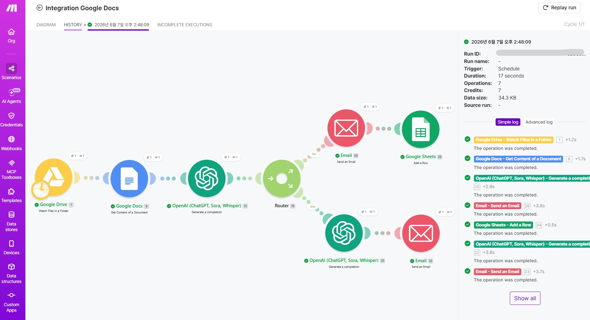
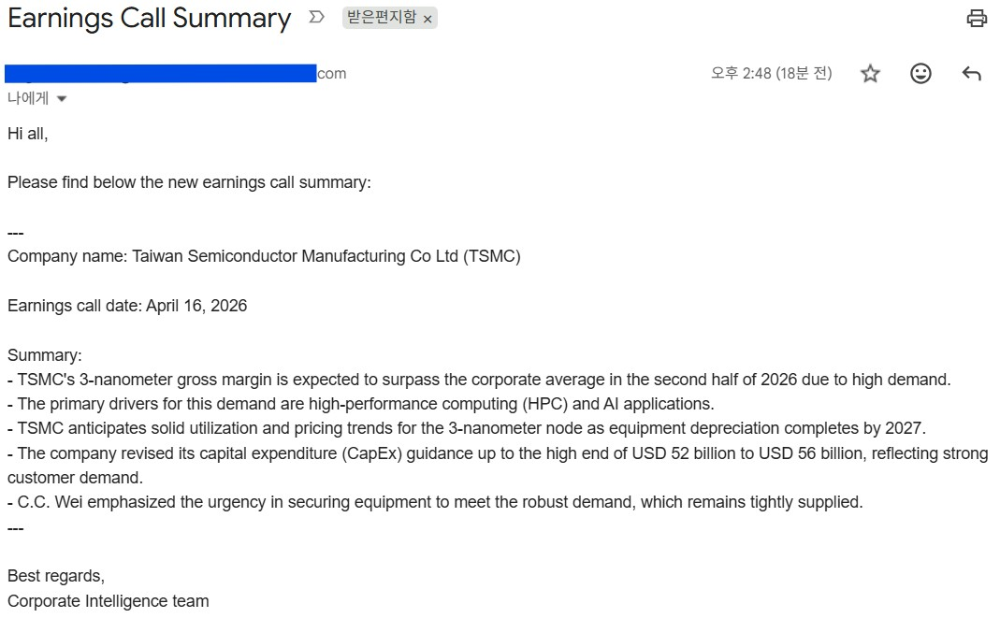
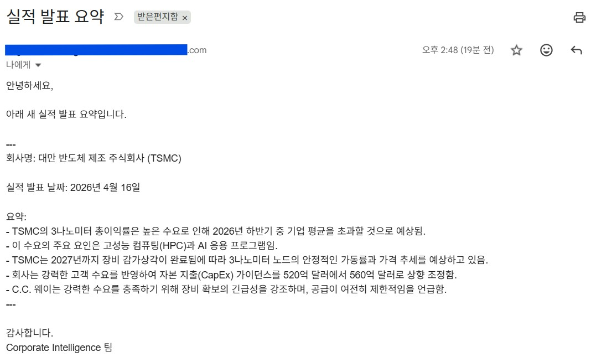
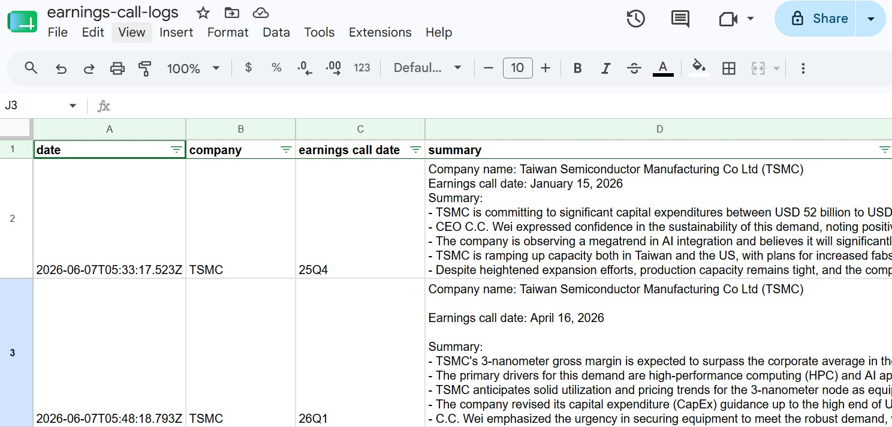

# 프로젝트 2 - 자유 주제 자동화 설계 및 구현 보고서

## 1. 자동화 대상 반복 업무 정의
* **업무 명칭:** 기업 실적 발표 컨퍼런스 콜 녹취록 문서 다국어 요약 및 이메일 발송.
* **자동화 업무 프로세스:** 기업 실적 발표 녹취록을 담당자가 Google Docs에 저장하면 AI가 자동으로 내용을 파싱하고 다국어로 요약하여 이해 당사자들에게 이메일을 발송하고 Google Sheets에 이력 기록.

## 2. 자동화 도구 선정 및 선정 이유
* **선정 도구:** Make
* **선정 이유:** 무료 플랜 내에서 3개 이상의 다단계 액션(AI요약, 이메일 전송, 스프레드 시트 기록)과 조건 분기(Router/Filter)를 추가할 수 있어 비용 리스크가 없고, 시각적 노드 구조와 자유롭게 이동이 가능한 노드로 유지보수가 용이. (참고: Zapier는 14일의 유료 플랜 체험 후 무료로 전환 됨)

## 3. 워크플로우 설계서

```
Google Drive Folder
        ↓
Watch Files in a Folder (Trigger)
        ↓
Get Google Doc Content
        ↓
AI Summarize (English)
        ↓
Router
   ├── Path 1: Send EN Email
   │         ↓
   │      Save EN record to Google Sheets
   │
   └── Path 2: AI Translate to Korean
             ↓
          Send KO Email
```


### 🛠️ 자동화 파이프라인 흐름도 및 설명

1. **Trigger: [Google Drive - Watch Files in a Folder]**  
   ➔ 지정된 폴더에 새 녹취록 파일(예: `회사이름-26Q1-transcript`)이 업로드되면 워크플로우가 자동으로 시작됨.

2. **Action 1 (본문 추출): [Google Docs - Get Content of a Document]**  
   ➔ 1번 트리거에서 넘어온 고유 `File ID`를 사용하여 문서 내부의 전체 녹취록 텍스트를 가져옴. (이 단계에서 파일 이름 `Title` 데이터 확보)

3. **Action 2 (AI 기본 요약): [OpenAI - Create a Completion]** (GPT-4o-mini; Role은 User사용)
   ➔ 2번에서 추출한 전체 녹취록을 기반으로, 굵은 글씨(`**...**`)를 제외한 지정된 포맷(Company name, Earnings call date, Summary)의 **영어 요약 전문**을 생성.

4. **조건 분기 (Router)**  
   ➔ 워크플로우를 아래 두 개의 독립된 경로(Path A, Path B)로 나누어 실행.

    #### 📍 Path A: 영어 요약본 발송 및 이력 관리

    * **Action 3A (이메일 전송): [Gmail - Send an email]**  
    ➔ 3번 OpenAI가 작성한 영어 요약 전문을 이메일 본문에 매핑하여 담당자 영어 수신 부서에 이메일 전송.
    * **Action 4A (이력 관리): [Google Sheets - Add a Row]**  
    ➔ 발송 이력을 구글 시트에 기록.
        * **date:** Make 내장 변수 `now`
        * **company:** `{{get(split(6.Title; "-"); 1)}}` (➔ 'xx회사')
        * **earnings call date:** `{{get(split(6.Title; "-"); 2)}}` (➔ '26Q1')
        * **summary:** 3번 OpenAI가 작성한 영어 요약 전문 재사용

    #### 📍 Path B: 한국어 번역본 발송 및 구글 시트 저장

    * **Action 3B (AI 한국어 번역): [OpenAI - Create a Completion]** (GPT-4o-mini; Role은 User사용)
    ➔ 3번 단계에서 생성된 '영어 요약 전문'을 입력값으로 받아, 기존 영어 요약 포맷의 틀을 그대로 유지한 채 한국어로 매끄럽게 번역.
    * **Action 4B (이메일 전송): [Gmail - Send an email]**  
    ➔ 3B 단계에서 완성된 한국어 번역본을 국내 담당자 수신 부서에 이메일 전송.

## 4. 구현 및 실행 증빙

* **워크플로우 최종 구현과 실행 결과 (성공 로그) 화면 캡처:**
    > 
* **최종 산출물 - 이메일:**
    > 
    > 
* **구글 시트 행 삽입 실행 결과:** 영어로만 행 삽입.
    > 